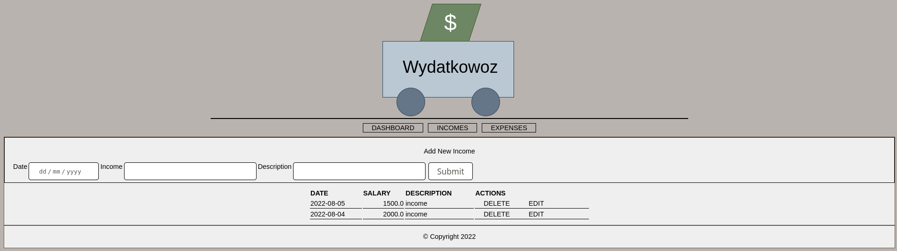
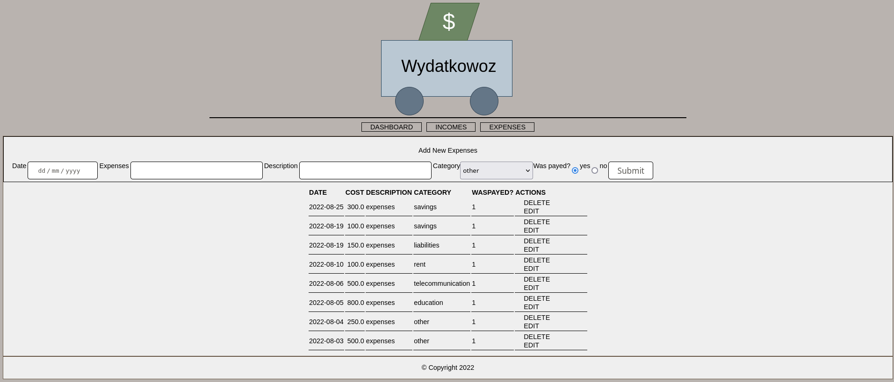

# Wydatkowoz

## Description

Simply application to manage home budget.





## How to run

> docker build -f Dockerfile -t wydatkowoz:latest .

> docker run --rm wydatkowoz:latest

### Podman

1. Build image

> podman build -t wydatkowoz:latest -f Dockerfile

Be careful for SElinux policies

```
ausearch -m avc -ts recent | audit2allow -a -M custom_container_app

******************** IMPORTANT ***********************
To make this policy package active, execute:

semodule -i custom_container_app.pp

```

2. Run container

> podman run -p 8080:5000 localhost/wydatkowoz:latest

If you want mount volume for persitance:

Example:

> podman run -d -p 8080:5000 -v /home/user:/app/data:Z localhost/wydatkowoz:latest

Remember to assign good permissions

> podman unshare chown 1999:1999 -R /home/user

3. Create systemd service

> podman generate systemd CONTAINER_NAME > /usr/lib/systemd/user/wydatkowoz.service

4. Reload services

> systemctl --user daemon-reload

5. Start service

> systemctl --user start wydatkowoz.service

> systemctl --user enable wydatkowoz.service